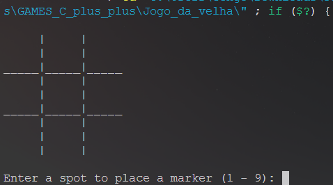
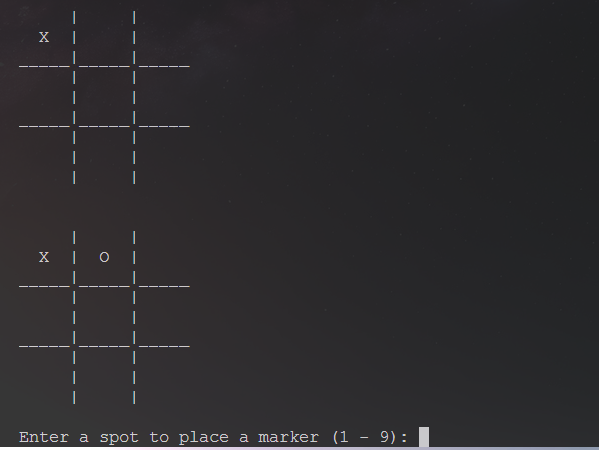
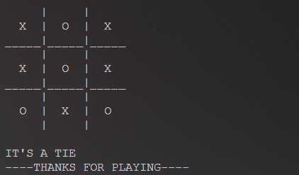
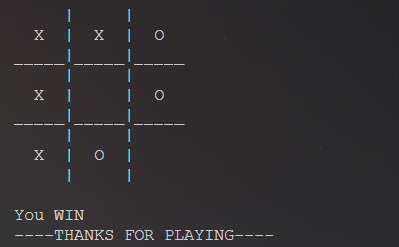
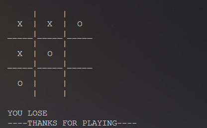

# ❌⭕ JOGO DA VELHA – Projeto em C++

> Um clássico jogo da velha com lógica de jogador versus computador, implementado em C++ com foco em clareza, organização e boas práticas de programação estruturada.

---

## 🎯 Objetivo

Este projeto foi desenvolvido com o propósito de aplicar fundamentos essenciais da linguagem **C++**, incluindo:

- Manipulação de vetores simples (`char[9]`)
- Funções modulares
- Controle de fluxo com condicionais e laços
- Entrada e saída no terminal com `std::cin` / `std::cout`
- Geração de jogadas automáticas com `rand()` e `ctime`
- Verificação de vitória ou empate com lógica condicional

---

## 🧠 Estrutura Lógica

A lógica principal é baseada em uma abordagem sequencial e modular:

- **`drawBoard()`** – Desenha o tabuleiro 3x3 com as posições atualizadas.
- **`playerMove()`** – Solicita e processa a jogada do jogador.
- **`computerMove()`** – Gera uma jogada aleatória válida para o computador.
- **`checkWinner()`** – Verifica todas as condições de vitória para jogador e computador.
- **`checkTie()`** – Detecta empate ao final do jogo.

O jogo alterna turnos entre jogador (X) e computador (O), até que uma condição de vitória ou empate seja alcançada.

---

## 🧰 Recursos Implementados

- ✅ Tabuleiro 3x3 desenhado dinamicamente
- ✅ Jogada do jogador com validação de entrada
- ✅ Jogada do computador com `rand()` e verificação de posição livre
- ✅ Detecção de todas as condições de vitória horizontais, verticais e diagonais
- ✅ Mensagens de vitória ou derrota para o jogador
- ✅ Detecção de empate
- ✅ Mensagem de encerramento amigável: `THANKS FOR PLAYING`

---

## 🖼️ Ilustrações

### 🕹️ Início do jogo

### 🎮 Jogadas iniciais

### 🤝 Empate

### 🏆 Vitória do Jogador

### ❌ Derrota do Jogador

---

## 🧑‍💻 Habilidades Demonstradas

- 💡 **Lógica de programação**
- 🧱 **Modularização de código**
- 🔁 **Uso de vetores e controle de fluxo**
- ⌨️ **Interação via terminal**
- 🧪 **Validação de entrada**
- ⏱️ **Uso de bibliotecas padrão (`<ctime>`) para aleatoriedade**

---

## ✍️ Autor

Desenvolvido por **Miguel de Castilho Gengo** como exercício de prática e consolidação de fundamentos da linguagem **C++** no contexto de jogos clássicos.  
Este projeto faz parte da coleção **GAMES_C_plus_plus**.

---

